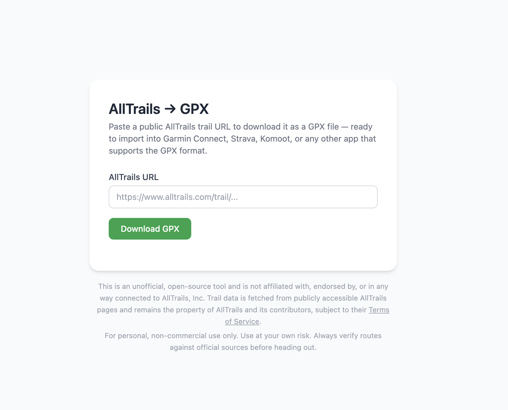

# AllTrails → GPX

A self-hosted web application that converts a public AllTrails trail URL into a
downloadable GPX file. Paste a URL, click a button, get a GPX file ready to
import into Garmin Connect, Strava, Komoot, or any other GPX-compatible app.

GPX conversion is powered by [alltrailsgpx](https://github.com/cdown/alltrailsgpx)
by [@cdown](https://github.com/cdown).



---

## Quick start

**Prerequisites:** Docker and Docker Compose.

```bash
git clone https://github.com/joooostb/alltrails-to-gpx.git
cd alltrails-to-gpx
docker compose up
```

Open [http://localhost:8080](http://localhost:8080).

---

## Running locally without Docker

**Prerequisites:** Go 1.22+, Node.js 22+, and
[alltrailsgpx](https://github.com/cdown/alltrailsgpx) on your `$PATH`.

```bash
# Install the alltrailsgpx binary (requires Rust)
cargo install alltrailsgpx --version 0.2.0 --locked

# Generate CSS and JS assets, then start the server
make run
```

The server starts on port `8080` by default.

---

## Configuration

All configuration is through environment variables.

| Variable | Default | Description |
|---|---|---|
| `PORT` | `8080` | HTTP listen port |
| `ALLTRAILSGPX_BIN` | `alltrailsgpx` | Path to the `alltrailsgpx` binary |
| `HTTP_REQUEST_TIMEOUT` | `30s` | Timeout for AllTrails HTTP requests |
| `CONVERSION_TIMEOUT` | `15s` | Timeout for the `alltrailsgpx` subprocess |
| `CACHE_TTL` | `5m` | How long a converted GPX file is kept in memory |
| `LOG_LEVEL` | `info` | Log verbosity: `debug`, `info`, `warn`, `error` |

Set `LOG_LEVEL=debug` to see alltrailsgpx stderr output alongside structured
Go logs.

---

## Kubernetes deployment

Manifests are in `k8s/`. Apply them in order:

```bash
kubectl apply -f k8s/deployment.yaml
kubectl apply -f k8s/service.yaml
kubectl apply -f k8s/networkpolicy.yaml
kubectl apply -f k8s/ingress.yaml
```

Update the `host` in `k8s/ingress.yaml` and the `certresolver` annotation to
match your Traefik and cert configuration.

The deployment runs as a non-root user with a read-only root filesystem,
dropped capabilities, and a `RuntimeDefault` seccomp profile.

---

## Building the Docker image

```bash
make docker-build
```

The image is built in four stages:

1. **asset-builder** (`node:22-alpine`) — compiles Tailwind CSS and copies htmx
2. **rust-builder** (`rust:1-slim`) — builds the `alltrailsgpx` binary
3. **go-builder** (`golang:1.26-alpine`) — compiles the Go server with assets embedded
4. **runtime** (`debian:bookworm-slim`) — only the two binaries, no build tools

---

## Development commands

| Command | Description |
|---|---|
| `make run` | Generate assets and start the server |
| `make test` | Run all tests with the race detector |
| `make static` | Regenerate CSS and download htmx (run after changing templates) |
| `make build` | Compile the server binary to `bin/server` |
| `make clean` | Remove generated files and build output |

---

## Disclaimer

This is an unofficial, open-source tool and is **not affiliated with,
endorsed by, or in any way connected to AllTrails, Inc.**

Trail data is fetched from publicly accessible AllTrails pages and remains the
property of AllTrails and its contributors, subject to their
[Terms of Service](https://www.alltrails.com/terms).

**For personal, non-commercial use only.** Always verify routes against
official sources before heading out.
